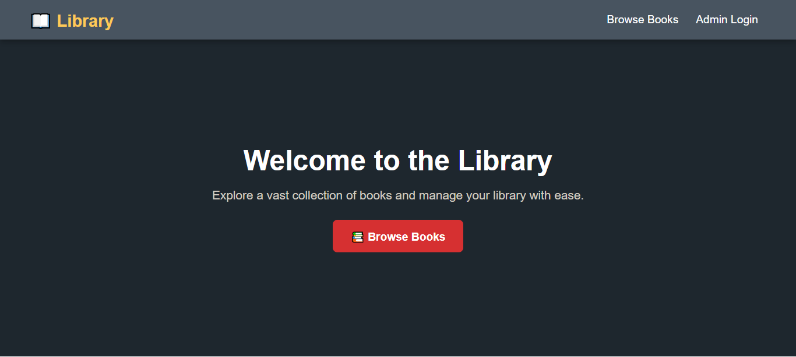
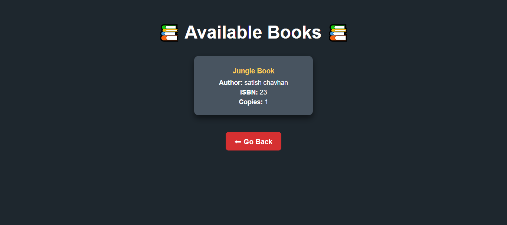

# 📚 Library Management System

A web-based Library Management System built with **Django** for managing books and user interactions efficiently.

## 🚀 Features

- Browse available books with details (title, author, ISBN, copies).
- Admin panel for managing books and users.
- Secure authentication for admin login.

## 🛠 Tech Stack

- **Backend:** Django, Django REST Framework
- **Frontend:** HTML, CSS
- **Database:** SQLite (default)

---

## ⚡ Installation and Setup

### **1️⃣ Clone the Repository**

```sh
git clone https://github.com/yourusername/library-management.git
cd library-management
```

### **2️⃣ Set Up a Virtual Environment**

```sh
python -m venv venv
source venv/bin/activate  # macOS/Linux
venv\Scripts\activate      # Windows
```

### **3️⃣ Install Dependencies**

```sh
pip install -r requirements.txt
```

### **4️⃣ Configure the Database**

By default, the project uses a **local SQLite database**. No additional configuration is needed. If you want to reset the database, delete the `db.sqlite3` file and run migrations again:

```sh
python manage.py migrate
```

### **5️⃣ Create a Superuser**

```sh
python manage.py createsuperuser
```

Follow the prompts to set up admin credentials.

### **6️⃣ Run the Development Server**

```sh
python manage.py runserver
```

Your app will be available at: **[http://127.0.0.1:8000/](http://127.0.0.1:8000/)**

---

## 🔗 Available Routes

| Route                  | Description                          |
| ---------------------- | ------------------------------------ |
| `/`                    | Home Page                            |
| `/admin/signup/`       | Admin Signup Page                    |
| `/admin/login/`        | Admin Login Page                     |
| `/api/books/`          | API to list and create books         |
| `/api/books/<int:pk>/` | API to retrieve/update/delete a book |
| `/student/books/`      | Student Books Page                   |

---

## 📸 Screenshots




